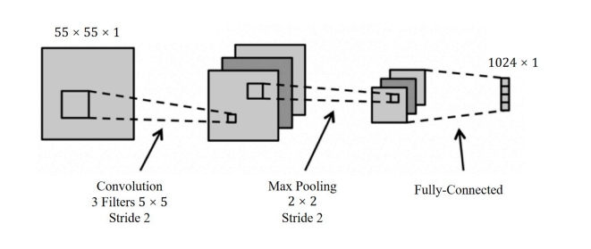
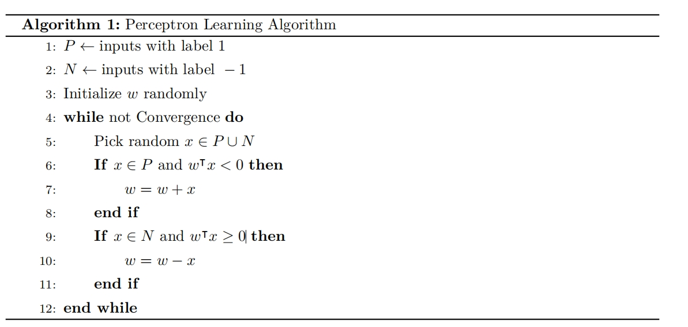

# HW3 - Report 深度学习

> 曹烨 2021012167 软23 caoye541@gmail.com

---

[toc]

---

## 1. 简答题

### Q1

> 什么是交叉熵（Cross Entropy）？在学习一个类别分布（Categorical Distribution）时，使用交叉嫡作为损失函数比绝对值损失函数（Absolute Error，$L_{a b s}=\left|y_i-\hat{y_i}\right|$ ）有什么好处？

交叉熵：交叉熵是衡量两个概率分布P和Q之间差异的一种方法。具体来说，交叉熵H(P,Q)表示：用概率分布Q来编码根据概率分布P生成的事件所需的平均比特数。它在机器学习特别是分类问题中被广泛用作损失函数。

其数学定义为：$H(P, Q)=-\sum_i P(i) \log Q(i)$

在学习一个类别分布时，其相对于绝对值损失函数的优点：

1. 梯度特性：交叉熵对严重错误提供更大梯度，加速模型改进；而绝对值损失的梯度始终恒定。

2. 可解释性：交叉熵是伯努利分布的最大似然函数的负对数似然，直接处理概率分布，更适合分类问题；绝对值损失缺乏概率解释；交叉熵等价于最大化对数似然，有坚实的统计学理论支持。

### Q2

> 多层感知机（Multilayer Perceptron）相比线性模型有哪些优势？相较于训练浅而宽的神经网络（＂宽度学习＂），训练相对窄而深的神经网络有什么好处？

**多层感知机相比线性模型的优势**：

1. 非线性建模能力：MLP可以通过非线性的激活函数`ReLU、sigmoid等`学习复杂的==非线性关系==；而线性模型只能表示线性关系。
2. 表示能力和可解释性：相对于线性模型，MLP通过多层结构，能够学习数据的层次化特征表示，捕捉更复杂的模式和抽象概念，也有更好的可解释性。
3. 便携性与特征自动提取：MLP能够自动学习有用的特征表示，减少手动需求。

**窄而深神经网络相较于宽度网络的好处：**

MLP的表达能力满足：$\Omega\left(\left(\frac{n}{d}\right)^{(L-1) d} n^d\right)$

其中 *n, d* 分别表示宽度和深度。因此相较于宽度学习，窄而深的神经网络提升的是d而不是n，其对MLP的拟合能力提升更高效。

同时深度学习网络可以专注于捕捉不同抽象层次的特征，后层能很好地利用前面的信息来进行高级的抽象和推理，可以更好地形成复杂的特征组合和抽象概念。

### Q3

> 卷积（Convolution）和互相关（Cross－correlation）分别是什么意思？在卷积神经网络中，卷积核通常进行的是卷积还是互相关操作？

卷积（Convolution）的定义：

一种数学运算，对于二维图像处理。特点是卷积核需要先翻转180度(水平和垂直方向)，再进行滑动计算。数学表达为：$(f * g)(x, y)=\sum_m \sum_n f(m, n) g(x-m, y-n)$

互相关（Cross－correlation）的定义：

卷积类似，但不需要翻转卷积核，直接将卷积核在图像上滑动并计算对应位置的加权和。其数学表达式为：$(f \star g)(x, y)=\sum_m \sum_n f(m, n) g(x+m, y+n)$

卷积神经网络中通常执行的是**互相关操作**而非严格意义上的卷积。因为CNN参数是学习得来，翻转意义不大而且互相关计算更直观简单。

### Q4

> 批量大小（Batch Size）对于优化器（比如随机梯度下降）影响巨大。为了减小现存占用，**小宣**提出将每次前向传播的批量大小减半，梯度累积两次再进行反向传播。请问这种方法能确保训练得到的模型效果参数一致吗（假设随机状态、batch 划分、dropout 的神经元相同）？若有影响，请指出原因（例如优化器、模型中的某些层）；若无影响，请论证。

有影响，原因如下：

1.  **批归一化层(Batch Normalization)**
   + 批归一化使用当前mini-batch的统计特性(均值和方差)
   + 当批量大小减半时，计算的统计量会有所不同
   + 这导致每个样本经过网络时的特征分布不同，**进而影响反向传播**
2. 优化器状态，大多数优化器的行为会受到影响
   + Adam/AdamW: 动量和二阶矩估计依赖于**单次更新的梯度**
   + RMSprop: 梯度平方的移动平均计算方式会改变
   + 带动量的SGD: 动量累积方式依赖于单次更新的梯度
   + 因此改成两次再反向后，会影响很多优化器的功效

### Q5

> 为什么说残差连接（Residual Connection）有利于训练更深层的深度网络？残差链接能够缓解梯度消失（Gradient Vanishing）的问题吗？

**残差连接有利于训练深层网络的原因：**

1. 解决退化问题：随着网络深度增加，传统网络性能往往会下降，残差连接有效解决了这一退化现象。
2. 简化学习目标：网络只需学习输入与输出之间的差异(残差部分)，而非完整映射，使学习目标更加明确。
3. 信息捷径：提供了信息的快速传递路径，保证前层信息能够直接传递到后层。

**残差连接对梯度消失问题的缓解：**

残差连接确实能缓解梯度消失问题。在反向传播时，梯度通过公式$∂L/∂x = ∂L/∂(F(x)+x) · [∂F(x)/∂x + 1]$ 传递，其中关键的"+1"项保证了即使F(x)的梯度趋近于零，总梯度也不会消失。

这使梯度能够无衰减地向浅层传播，避免了传统深层网络中多个小于1的值连乘导致的梯度消失问题，从而增强了网络训练的数值稳定性。

## 2. 解答题

### 2.1 卷积神经网络

一个卷积神经网络的前向传播过程如下图所示，它依次通过以下各层将一张尺寸为 $55 \times 55 \times 1$的单通道图片转换为 $1024 \times 1$ 的输出：卷积层（Convolution）、最大池化层（Max Pooling）、ReLU、全连接层（各层参数已在图中列示），且在该网络中，我们将不使用任何偏置参数（Bias Parameters）。则对于该网络：

1．卷积层共有多少个可学习参数？
2．最大池化层的输出的尺寸为多少？
3．在前向传播过程中，对于每个样本需要进行多少次 ReLU 函数计算
4．为了给模型加人非线性，需要在网络中加入激活函数，请列举两个激活函数。

#### 2.1.1

$$
3\times5\times5=75
$$

卷积层一共有75个可学习参数

#### 2.1.2

Max Pooling的输入尺寸是3通道，其尺寸是：
$$
(\frac{55-5}{2}+1)\times(\frac{55-5}{2}+1)=26\times26
$$
所以其输出层的尺寸是：
$$
(\frac{26-2}{2}+1)\times(\frac{26-2}{2}+1)=13\times13
$$
综上所述，最大池化层的输出的尺寸为13×13

#### 2.1.3

$$
13\times13\times3=507
$$

一共需要507次ReLU计算

#### 2.1.4

激活函数有：ReLU、tanh、GeLU、sigmoid等等

---

### 2.2 注意力机制

本题中我们将探究利用 GPT 类架构进行机器翻译过程中的注意力机制计算过程。

假设我们想要翻译＂他 $\mid$ 喜欢 $\mid$ 苹果＂这一中文句子（ 3 个 token 使用坚线分隔），在 GPT 的某一自注意力层中 3 个 token 的 query、key、value 向量分别记作 $Q=\left\{q_1, \ldots, q_3\right\}, K=\left\{k_1, \ldots, k_3\right\}, V=$ $\left\{v_1, \ldots, v_3\right\}, q_i, k_i, v_i \in \mathbf{R}^d$ 。

1. 请写出经过带掩码的自注意力层

$$
Y=\operatorname{Attention}(Q, K, V)=\operatorname{Softmax}\left(\frac{Q K^T}{\sqrt{d}}\right) V
$$

之后每个 token 对应的输出 yi 的表达式。（注意以上公式中省略了掩码）

2. 设 $d=4, K=\left\{\left[\begin{array}{c}0 \\ 1 \\ -1 \\ 0\end{array}\right],\left[\begin{array}{l}1 \\ 0 \\ 1 \\ 1\end{array}\right],\left[\begin{array}{c}0 \\ -1 \\ 0 \\ -1\end{array}\right]\right\}$ 。

当 GPT 模型预测翻译的第一个 token（英文单词）＂ He ＂的时候，它应该需要尽量多的来自 token＂他＂的信息。请写出向量 $q_3$ 的一个取值，满足 $q_3$ 的 2 范数不超过 1 ，且与第一个 token 的自注意力权重（相比别的 token）最大，并写出此时 $y_3$ 关于 $v_1, v_2, v_3$ 的表达式。

3. 设生成了 token＂He＂之后，计算到这一层时，$k_4=(-1,0,-1,-1)^T$ 。当 GPT 模型预测翻译的第二个 token（英文单词）＂likes＂的时候，它同时需要＂喜欢＂和＂He＂的信息（因为＂likes＂是第三人称单数形式），此时多头自注意力机制可以胜任。假设以 query，key，value向量的前两维和后两维作为两个自注意力头（Heads）的特征向量，请写出向量 $q_4$ 的一个取值，满足 $q_4$ 的 2 范数不超过 1，且在第一个自注意力头中与第二个 token（＂喜欢＂）的自注意力权重（相比别的 token）最大，在第二个自注意力头中与第四个 token（＂He＂）的自注意力权重最大，并写出此时 $y_4$ 的表达式。

#### 2.2.1

在掩码自注意力机制中，每个token只能关注当前及之前位置的信息，无法"看到"未来的token。这种机制在矩阵表示中，通过保留下三角部分并将上三角部分赋予极大负值（接近负无穷）来实现。这样，在softmax计算过程中，这些被掩蔽的位置对应的权重会趋近于零，从而被有效忽略。

因此，位置i的输出向量$y_i$可精确表达为：
$$
y_i=\sum_j \frac{\exp \left(q_i k_j / \sqrt{d}+M_{i j}\right)}{\sum_p \exp \left(q_i k_p / \sqrt{d}+M_{i p}\right)} v_j
$$
其中掩码矩阵$M$的元素定义为：

- 当$i \geq j$时，$M_{i j}=0$（允许关注当前及之前位置）
- 当$i < j$时，$M_{i j}=-\infty$（禁止关注未来位置）

#### 2.2.2

如果希望$q_3$对于第一个token自注意力权重（相比别的 token）最大，其实对应着其二者相似度最大，所以可以取：
$$
q_3=\left[\begin{array}{c}
0 \\
\frac{1}{\sqrt{2}} \\
-\frac{1}{\sqrt{2}} \\
0
\end{array}\right]
$$
因此
$$
Y_3=\frac{\exp (1 / \sqrt{2})}{\exp (1 / \sqrt{2})+2 \exp (1 /(2 \sqrt{2}))} v_1+\frac{\exp (1 /(2 \sqrt{2}))}{\exp (1 / \sqrt{2})+2 \exp (1 /(2 \sqrt{2}))} v_2+\frac{\exp (1 /(2 \sqrt{2}))}{\exp (1 / \sqrt{2})+2 \exp (1 /(2 \sqrt{2}))} v_3
$$
计算得：
$$
Y_3=0.59v_1+0.20v_2+0.20v_3
$$

#### 2.2.3

增加了一个token后，原来的向量被拆分成了前两个维度与后两个维度的特征向量，这样就分到了两个注意力头中。

我们希望$q_4$的的第一个注意力头中和$k_2$的权重最大，第二个注意力头中和$k_4$的权重最大。

因此可以设计成：
$$
q_4=\left[\begin{array}{c}
\frac{1}{\sqrt{3}}  \\
0 \\
-\frac{1}{\sqrt{3}} \\
-\frac{1}{\sqrt{3}} 
\end{array}\right]
$$
故有：
$$
\begin{aligned}
Y_4= & \frac{\exp (1 /(2 \sqrt{3}))}{\exp (1 /(2 \sqrt{3}))+\exp (-1 /(2 \sqrt{3}))+\exp (1 /(2 \sqrt{3}))+\exp (1 /(2 \sqrt{3}))} v_1 \\
& +\frac{\exp (-1 /(2 \sqrt{3}))}{\exp (1 /(2 \sqrt{3}))+\exp (-1 /(2 \sqrt{3}))+\exp (1 /(2 \sqrt{3}))+\exp (1 /(2 \sqrt{3}))} v_2 \\
& +\frac{\exp (1 /(2 \sqrt{3}))}{\exp (1 /(2 \sqrt{3}))+\exp (-1 /(2 \sqrt{3}))+\exp (1 /(2 \sqrt{3}))+\exp (1 /(2 \sqrt{3}))} v_3 \\
& +\frac{\exp (1 /(2 \sqrt{3}))}{\exp (1 /(2 \sqrt{3}))+\exp (-1 /(2 \sqrt{3}))+\exp (1 /(2 \sqrt{3}))+\exp (1 /(2 \sqrt{3}))} v_4
\end{aligned}
$$
计算得：
$$
Y_4=0.27v_1+0.05v_2+0.27v_3+0.27v_4
$$

### 2.3 【附加题】感知机的收敛保证

在课程中，我们讲解了感知机（Perceptron），一个经典的学习算法。下面，让我们考虑感知机对于－ 1,1 分类任务下的收玫保障。具体来讲，在这种设定下，我们有数据集 $\mathcal{D}=\left\{(x, y), x \in \mathbb{R}^d, y \in\right.$ $\pm 1\}$ ，我们希望学习一组参数 $w \in \mathbb{R}^d$ ，对于数据 $x$ 的标签 $y$ 进行预测：$f(x)=\operatorname{sign}\left(w^{\boldsymbol{\top}} x\right)$ 。在此设定下，感知机算法如下：

下面，请证明：

若有 $\forall i \in|\mathcal{D}|,\left\|x_i\right\|<1, \exists w^* \in \mathbb{R}^d, \gamma>0$, s．t．$\left\|w^*\right\|=1, \forall\left(x_i, y_i\right) \in \mathcal{D}, y_i w^{* \top} x_i>\gamma$（即存在一个过原点的划分平面，有安全距离 $\gamma$ ）。该算法收玫前最多触发 $\frac{1}{\gamma^2}$ 次预测错误。

## 3. 深度学习与 AlphaZero

> 在之前的作业中，我们实现了 AlphaZero 的训练流程，并尝试用线性模型学习围棋的策略和价值函数。但是，简单的线性模型并不足以建模复杂的围棋问题，我们需要引入深度神经网络来解决围棋问题。
>
> 任务目标 本次作业中，我们将继续在 $7 \times 7$ 围棋问题上探索 AlphaZero 算法的能力。下发的代码文件中，已经实现了一个简单的全连接网络的示例（`model／example＿net．py：MLPNet`，你需要先利用示例网络运行 AlphaZero 训练，然后参考示例网络，自己设计并实现一个深度网络，测试训练效果。提交时请删除＊．so，＊．pyd 和＊／build／等临时文件和训练过程的 ckeckpoint，仅提交代码和 1 个最好的模型参数文件，本题的文字报告请和其他题目写在同一个文档中提交。
>
> Tips：
>
> 1. 参数选择：完成上述题目时，可以自由选择适合你的情况的参数进行训练，但过于不合理的参数设置可能会导致扣分（若报告未说明实验使用的参数，则会以提交的代码为准）。
> 2. 文件大小限制：提交的模型参数文件大小不能大于 32 MB ，且只能提交 1 个你认为效果最好的模型参数文件（有特殊情况请与助教提前沟通）。
> 3. 在` model／example＿net．py `中预留了一个 MyNet 类用于实现你自己设计的深度模型。你也可以将其重命名为合适的名字。
> 4. 模型设计不是越复杂越好，过于复杂或者参数量过大的模型可能导致训练缓慢，容易过拟合。
> 5. 卷积层的实现你可能会用到` torch．nn．Conv2D`回和 `torch．nn．BatchNorm2D`。
> 6. 推荐使用并行脚本`alphazero＿parallel．py`进行训练，并根据实验环境实际情况，使用合适并行数（主函数中 N＿WORKER 变量控制）。训练时间可能较长，建议提前评估合理安排。
> 7. 本次作业下发的训练期本默认会覆盖同一保存路径下的文件，训练时请做好备份，或确保使用了不同的保存路径。

1．将之前作业中完成的代码填人对应位置，运行训练，并汇报使用 MLP 模型的 AlphaZero 算法训练过程中对 Random Player 的胜率，和训练过程的 elo 分数曲线图。

2．参考示例代码，设计并实现一个不一样的深度模型，要求至少需要使用一个卷积层处理二维棋盘特征。请绘制网络结构图，并简要说明设计的理由。

3．使用自己设计的深度模型，运行训练，并汇报训练过程中 AlphaZero 算法对 Random Player的胜率以及 elo 分数曲线图。要求训练过程中，对 Random Player 的胜率至少有一次不低于 $90 \%$ 。

4．修改 `pit＿puct＿mcts．py`，加载训练后的 MLP 模型和自己设计的模型进行对弈，汇报对局的胜率。
