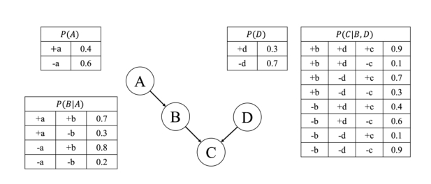
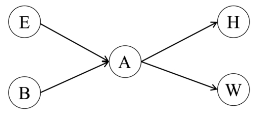

# HW4 - Report 推理和语言模型

> 曹烨 2021012167 软23 caoye541@gmail.com

---

[toc]

---

## T1：贝叶斯网络

考虑以下含有 4 个变量 $A, B, C, D$ 的贝叶斯网络。相应的条件概率表如下。
（a）计算 $p(-a,-b,-c,+d)$ 。
（b）计算 $p(+b)$ 。
（c）计算 $p(-a \mid+b)$ 。
（d）计算并比较 $p(+b)$ 和 $p(+b \mid-d)$ 两者的值是否相等，并从随机变量独立的角度进行解释。
（e）计算并比较 $p(-a \mid+c)$ 和 $p(-a \mid+c,-d)$ 两者的值是否相等，并从随机变量条件独立的角度进行解释。

---

## T2：变量消除法

在如下图所示的贝叶斯网络中，我们希望通过变量消除法计算 $P(B=b \mid W=w)$ 。初始因子为 $P(e), P(b), P(a \mid b, e), P(h \mid a), P(w \mid a)$ 。

（a）假设消除顺序为 $E \rightarrow H \rightarrow A$ 。请写出每一步产生的新因子的表达式并列出剩余的因子。
（b）请说明如何使用剩余的因子计算 $P(B=b \mid W=w)$ 。
（c）因子大小是变量消除法计算复杂度的关键因素。例如，假设所有的变量都是二元变量，则因子 $P(H \mid A)$ 的大小是 2 ，它有 $2^2$ 种取值需要维护；由于 $W$ 已经被观测，因子 $P(W \mid A)$ 的大小是 1 ，它只有 $2^1$ 种取值需要维护。在以上变量消除的过程中，最大的因子是哪个，它有多少种取值需要维护？简要说明若改用顺序 $E \rightarrow A \rightarrow H$ ，最大中间因子的维度是否会更小、相同或更大，并说明理由。

---

## T3：朴素贝叶斯

一位心理学家做了一个关于＂幸福＂的调查。每个受访者提供一个向量，其元素 1 或 0 分别对应于他们对某一问题回答＂是＂或＂否＂。该向量的属性为

$$
\mathbf{x}=\text { (rich, married, healthy). }
$$

例如，回答 $(1,0,1)$ 表示受访者＂富有＂、＂未婚＂、＂健康＂。此外，每个受访者如果对自己的生活感到＂满意＂，就给出一个 $y=1$ 的数值；如果＂不满意＂，就给出 $y=0$ 。

心理学家一共收到了 9 份问卷，声称对自己的生活感到＂满意＂的人给出的问卷结果为：

$$
(1,1,1),(0,0,1),(1,1,0),(1,0,1) ;
$$
而对于＂不满意＂的人，则是：$(0,0,0),(1,0,0),(0,0,1),(0,1,0),(0,0,0)$ 。
基于以上数据，使用朴素贝叶斯分类器（不带 Laplacian smoothing），
（a）一个＂不富有＂、＂已婚＂、＂健康＂的人感到＂满意＂的概率是多少？
（b）一个＂不富有＂、＂已婚＂的人感到＂满足＂的概率是多少？（也就是说，我们不知道他们是否 ＂健康＂）

---

## T4：编程题：语言模型

> 在本题中，你将基于简化版本的 GPT 语言模型框架，深人理解语言模型的关键结构模块的实现原理和设计理念。我们已经完成了基础的模型定义，包括嵌人层、位置编码、注意力机制、前馈网络以及残差连接，你需要实现模型中的关键计算模块或替换其中的部分模块。
>
> 注意：本题主要考察代码实现的正确性。如果你的设备性能受限导致训练时间过长，你可以适当调整训练参数以缩短整体训练时间。

### 4.1. Gradient Accumulation

> 在语言模型的训练过程中，使用较大的 batch size 通常有助于提高训练稳定性、减少梯度方差并加速收敛。但在显存有限的条件下，大 batch size 并不总是可行。为此，我们可以采用梯度累积（Gradient Accumulation）技术，通过多次小 batch 的前向－反向传播来模拟大 batch 的效果。设累积步数为 $k$ ，小 batch 的损失函数为 $\mathcal{L}_t$ ，则每次更新的累积损失为：
>
> $$
> \mathcal{L}_{\text {accum }}=\frac{1}{k} \sum_{i=1}^k \mathcal{L}_{t+i}
> $$
>
>
> 每次更新模型参数时反向传播的梯度为：
>
> $$
> \nabla \theta=\nabla_\theta\left(\mathcal{L}_{\text {accum }}\right)=\frac{1}{k} \sum_{i=1}^k \nabla_\theta \mathcal{L}_{t+i}
> $$
>
>
> 请你修改现有的训练代码，使其支持梯度累积机制，每隔若干步进行一次模型参数更新，模拟较大 batch size 的效果。

### 4.2. 实现因果自注意力机制 (Causal Self-Attention)

> 你需要手动实现 GPT 模型中的核心计算模块：Causal Multi－Head Self－Attention，不能借助 nn ．MultiheadAttention 等已有实现。模块输人特征与维度约定如下：
>
> 令输人为一个三维张量 $X \in \mathbb{R}^{B \times L \times C}$ ，其中 $B$ 为 batch 大小，$L$ 为序列长度，$C$ 为嵌人维度，满足 $C=h \cdot d$ ，即头数乘以每个头的维度大小。计算步骤如下：
>
> **1．QKV 映射（带偏置）：**
>
> 使用一组共享线性变换对输人进行查询 $(Q)$ 、键 $(K)$ 和值 $(V)$ 的映射：
> $$
> Q=X W^Q+b^Q, \quad K=X W^K+b^K, \quad V=X W^V+b^V
> $$
> 其中 $W^Q, W^K, W^V \in \mathbb{R}^{C \times C}, b^Q, b^K, b^V \in \mathbb{R}^C$ 。
>
> **2．重构为多头形式：**
> 将 $Q, K, V$ reshape 为多头表示：
> $$
> Q, K, V \in \mathbb{R}^{B \times h \times L \times d}
> $$
>
> **3．缩放点积注意力：**
>
> 计算注意力得分：
> $$
> A=\frac{Q K^{\top}}{\sqrt{d}} \in \mathbb{R}^{B \times h \times L \times L}
> $$
>
> **4．应用 Causal Mask：**
>
> 使用下三角掩码 $\mathbf{M} \in\{0,1\}^{L \times L}$ 限制未来信息访问，确保模型生成过程只依赖于过去的信息：
> $$
> A_{i, j}= \begin{cases}A_{i, j}, & \text { if } j \leq i \\ -\infty, & \text { if } j>i\end{cases}
> $$
>
> **5．使用 Softmax 归一化注意力得分：**
> $$
> A=\operatorname{Softmax}(A) \in \mathbb{R}^{B \times h \times L \times L}
> $$
>
> **6．上下文表示计算：**
>
> 将注意力得分与值向量加权求和：
> $$
> Z=A V \in \mathbb{R}^{B \times h \times L \times d}
> $$
>
> **7．头合并与线性投影：**
>
> 将所有头拼接在一起，并使用一个线性层将张量映射回原始维度：
> $$
> Y=\operatorname{Concat}\left(Z_1, \ldots, Z_h\right) W^O+b^O \in \mathbb{R}^{B \times L \times C}
> $$
>
> 其中 $W^O \in \mathbb{R}^{C \times C}, b^O \in \mathbb{R}^C$ 。
>
> 你需要依照上述计算流程，补全 CausalSelfAttention 类的代码。实现要求：
>
> - 使用 torch．matmul 或＠运算符完成注意力机制的计算。
> - 手动构造 causal mask（可调用 torch．tril）。
>
> 使用补全后的代码进行模型训练，汇报训练过程中 Training Loss 和 Val Loss 的变化过程。

### 4.3. 位置编码的实现与对比

> 在我们提供的代码中，使用了可学习的位置编码（nn．Embedding）。近年来，旋转位置编码（Rotary Positional Embedding，RoPE）作为一种结构更为精巧的相对位置编码方法被广泛采用，尤其在 LLaMA 等模型架构中表现良好。在本题中，你需要实现使用 RoPE 作为位置编码的 Transformer 模型进行训练，并汇报 Training Loss 和 Val Loss 的变化过程。
>
> RoPE 的形式化定义如下：给定一对输人向量 $x=\left[x_0, x_1, \ldots, x_{d-1}\right] \in \mathbb{R}^d$ ，设维度 $d$ 为偶数，将其视为 $d / 2$ 个二维向量对：
>
> $$
> \mathbf{x}^{(i)}=\left[\begin{array}{c}
> x_{2 i} \\
> x_{2 i+1}
> \end{array}\right] \quad \text { for } i=0,1, \ldots, \frac{d}{2}-1
> $$
>
>
> 对于第 $i$ 对位置向量，在位置 $p$ 上定义旋转频率参数：
>
> $$
> \theta_i=\frac{1}{10000^{2 i / d}}
> $$
>
>
> 对应的二维旋转矩阵为：
>
> $$
> R\left(p, \theta_i\right)=\left[\begin{array}{cc}
> \cos \left(p \cdot \theta_i\right) & -\sin \left(p \cdot \theta_i\right) \\
> \sin \left(p \cdot \theta_i\right) & \cos \left(p \cdot \theta_i\right)
> \end{array}\right]
> $$
>
>
> 将每个二维向量应用该旋转操作：
>
> $$
> \mathbf{x}_p^{(i)}=R\left(p, \theta_i\right) \cdot \mathbf{x}^{(i)}
> $$
>
>
> 最终，位置编码后的向量 $x_p^{\prime}$ 为各个旋转结果拼接而成：
>
> $$
> x_p^{\prime}=\left[\mathbf{x}_p^{(0)} ; \mathbf{x}_p^{(1)} ; \ldots ; \mathbf{x}_p^{(d / 2-1)}\right]
> $$
>
>
> 对于注意力机制中的 $Q, K \in \mathbb{R}^{B \times h \times L \times d}$ ，将上述旋转分别应用于每个位置 $p \in\{0, \ldots, T-1\}$上的表示。 $V$ 不做变换。
>
> 注意力权重仍然按以下方式计算：
>
> $$
> \operatorname{Attention}(Q, K, V)=\operatorname{Softmax}\left(\frac{Q^{\prime} K^{\prime T}}{\sqrt{d}}\right) V
> $$
>
> 其中 $Q^{\prime}, K^{\prime}$ 是经过 RoPE 旋转的位置相关表示。
> 请实现使用 RoPE 作为位置编码的模型，并汇报 Training Loss 和 Val Loss 的变化过程。注意，在该模型中，原本的位置编码需要被移除，且 RoPE 的实现应当被集成在 CausalSelfAttention类的实现中。

### 4.4. 实现语言模型的采样函数

在我们给出的代码中，已经实现了语言模型的 top－k 采样策略，即每次生成新的 token 时，从概率大小前 k 的 token 中进行采样。还有一种所谓的 top－p 采样策略，每次只从累积概率超过阈值 $p$ 的最小单词集合中进行随机采样。其形式化定义如下。

设当前时刻模型输出的 token 概率分布为：

$$
P=\operatorname{Softmax}(z) \in \mathbb{R}^{|V|}
$$

其中 $z \in \mathbb{R}^{|V|}$ 是 logits 向量，$|V|$ 是词表大小。

我们将所有 token 按概率从大到小排序，记排序后 token 的索引为：

$$
\pi=\operatorname{argsort}(P), \quad \text { 使得 } P_{\pi_1} \geq P_{\pi_2} \geq \cdots \geq P_{\pi_{|V|}}
$$

选取最小的前 $k$ 个 token，使得它们的概率累计和不小于阈值 $p$ ：

$$
\sum_{i=1}^k P_{\pi_i} \geq p, \quad \text { 且 } \quad \sum_{i=1}^{k-1} P_{\pi_i}<p
$$

最终仅在这些 token 上归一化进行采样：

$$
\hat{P}_i=\left\{\begin{array}{ll}
\frac{P_i}{\sum_{j \in S} P_j}, & i \in S \\
0, & i \notin S
\end{array} \quad \text { 其中 } S=\left\{\pi_1, \ldots, \pi_k\right\}\right.
$$

请参考现有模型中的 generate 函数，实现使用 top－p 策略的采样函数，并在报告中附上使用两种策略生成的文本片段。