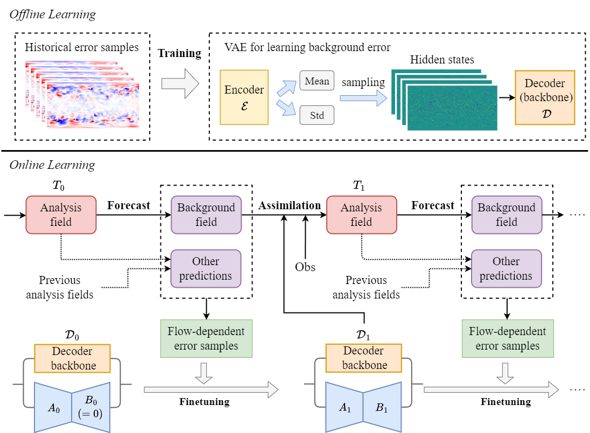
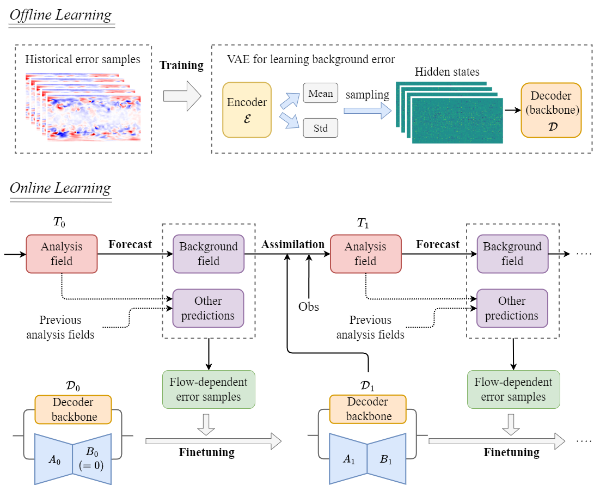
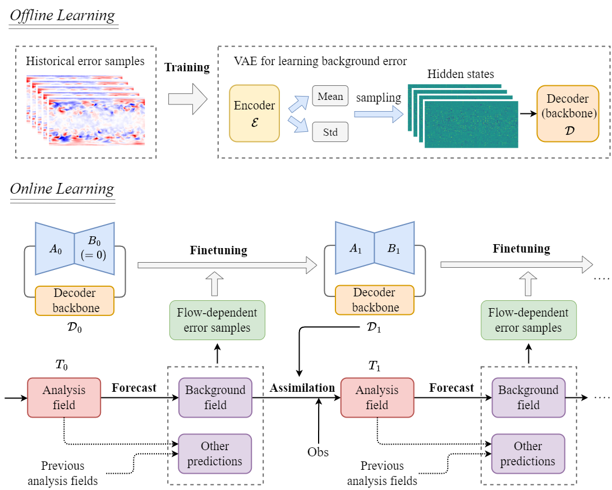
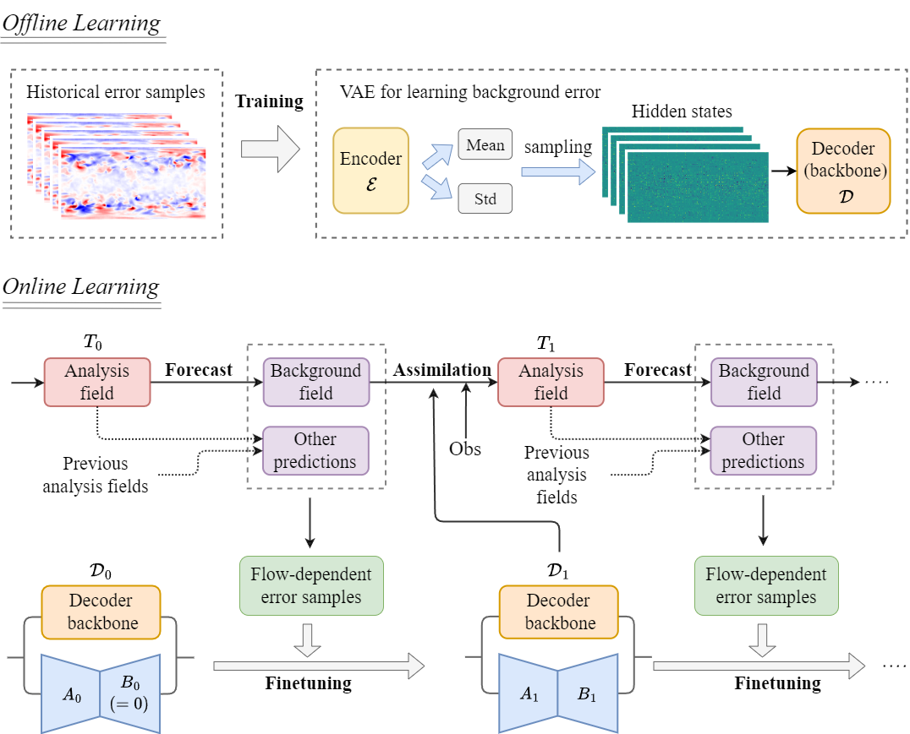
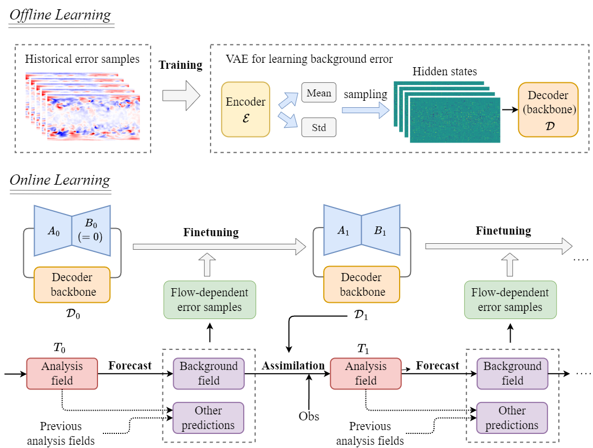

# Framework图的美化尝试与微调

### version 0 

目前这个框架图已经非常非常好了，叙述清晰，配色合适。

先是试了试改配色方案和大改排版，都无疾而终（×）。

整体观察图，感觉有几点可能可以改进的：

1. 整体太紧凑了感觉可以试试松一点？
2. 离线工作流、在线工作流，这种大标题比较小，没有很突出，分割黑线太重了视觉上可能比较突兀？
3. 感觉我们工作需要突出的是Finetuning这个，它的大小和位置可能没有特别显眼和突出，考虑将其突出化

### Version 1

做了以下更改：

1. 将所有方框都改成带统一圆角了。（但是无圆角和有圆角是不是有区分作用，在想要不要改回来）
2. 把整体排版拉长了点
3. 突出了离线学习和在线学习的两个小标题

### Version 2

基于Version1做了以下更改：

1. 尝试突出finetuning工作流，把它的位置放在图中心，使得其更抓眼球
2. 微调了其余元素位置，让他们协调一点

### Version 3

基于Version1做了以下更改：

1. 尝试突出finetuning工作流，所以把`forecast`和`assimilation`工作流整体缩小并加上了透明度
2. 再微调了位置来协调

### Version 4

基于Version2做了以下更改：

1. 尝试突出finetuning工作流，所以把`forecast`和`assimilation`工作流整体压扁
2. 回归了US-letter的页面比，但是工作流仍然是突出的